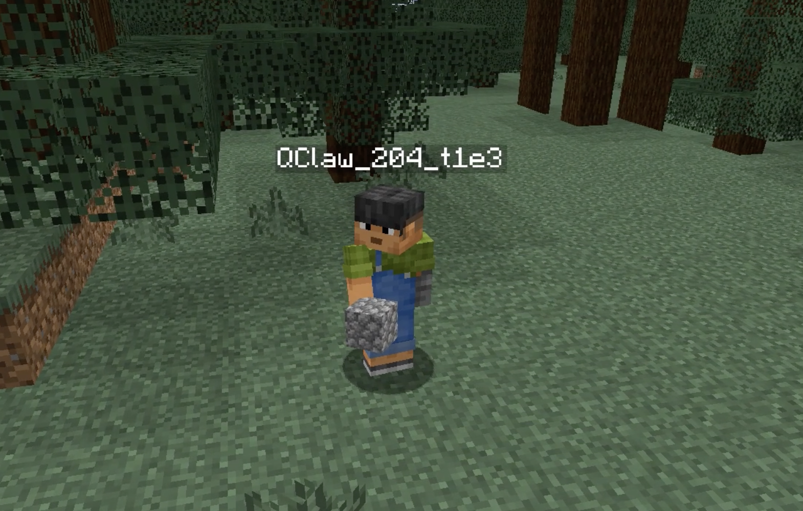

# MC Claw



用 AI Agent 自主玩 Minecraft 生存模式。

AI Agent 作为"大脑"进行感知、决策和规划，Mineflayer Bot 服务作为"手脚"连接 Minecraft 服务器并执行具体动作。两者通过 HTTP API 通信，互不依赖生命周期。

```
┌─────────────────────────────────────────────┐
│              Mineflayer Bot 服务              │
│  持久运行，维护游戏连接，缓存事件日志          │
│  暴露 HTTP API：查状态 / 发指令 / 读日志       │
└──────────────┬──────────────────┬────────────┘
               │ 查询状态          │ 发送指令
┌──────────────▼──────────────────▼────────────┐
│            AI Agent（定时唤醒）                │
│  每轮循环：感知 → 复盘 → 规划 → 执行 → 记忆   │
└──────────────────────────────────────────────┘
```

## 功能

- **20+ 动作指令**：移动、挖掘、放置、合成、熔炼、进食、战斗、探索、箱子操作、建造等
- **配方数据库**：集成 788 种物品的获取方式和完整依赖树（数据来自 [Odyssey](https://github.com/zju-vipa/Odyssey)，MIT 许可证）
- **经验系统**：自动从失败中学习，记录问题和解决方案
- **记忆系统**：记住地标（工作台、熔炉、箱子位置）、资源分布、关键事实
- **反射层**：自动进食、自动反击、自动庇护等生存反射
- **监控面板**：实时查看 Bot 状态的 Web Dashboard

## 快速开始

### 前置条件

- Node.js 18+
- Minecraft Java Edition 1.20（需要一个运行中的服务器或 LAN 游戏）

### 启动 Bot 服务

```bash
cd bot-service
cp config.example.json config.json  # 按需修改配置
npm install
npm start
```

Bot 服务默认连接 `localhost:18888`，HTTP API 监听 `3001` 端口。

通过环境变量自定义配置：

```bash
MC_HOST=your-server MC_PORT=25565 HTTP_PORT=3001 BOT_USERNAME=MyBot npm start
```

### 验证服务

```bash
# 健康检查
curl http://localhost:3001/health

# 查看 Bot 状态
curl http://localhost:3001/state

# 查看周围环境
curl -X POST http://localhost:3001/action \
  -H "Content-Type: application/json" \
  -d '{"type": "lookAround"}'

# 查询物品配方
curl "http://localhost:3001/recipe?item=diamond_pickaxe&depth=5"
```

### 监控面板

启动 Bot 服务后，浏览器打开 `http://localhost:3001/dashboard` 查看实时状态。

## API

| 端点 | 方法 | 说明 |
|------|------|------|
| `/health` | GET | 服务健康检查 |
| `/state` | GET | Bot 位置、血量、饥饿值、背包、周围环境 |
| `/logs` | GET | 最近事件日志 |
| `/action` | POST | 执行单个动作 |
| `/action/batch` | POST | 批量执行动作序列 |
| `/recipe` | GET | 查询物品配方和依赖树 |
| `/report` | POST | Agent 汇报当前计划 |
| `/reset` | POST | 重置 Bot（新一局） |
| `/dashboard` | GET | 监控面板 |

## 动作指令

### 基础动作

| 指令 | type | payload | 说明 |
|------|------|---------|------|
| 聊天 | `chat` | `{message}` | 发送聊天消息 |
| 移动 | `goto` | `{x, y, z}` | A* 寻路到指定坐标 |
| 查看周围 | `lookAround` | - | 获取附近方块、生物、玩家 |
| 挖掘 | `dig` | `{x, y, z}` | 挖指定位置方块 |
| 放置 | `place` | `{x, y, z, blockName}` | 在指定位置放方块 |
| 攻击 | `attack` | `{entityName?}` | 攻击最近/指定生物 |
| 查看背包 | `inventory` | - | 列出背包物品 |
| 装备 | `equip` | `{itemName, destination}` | 切换手持/穿戴 |

### 复合动作

| 指令 | type | payload | 说明 |
|------|------|---------|------|
| 合成 | `craft` | `{itemName, count?}` | 自动查配方合成，失败时报告缺料 |
| 熔炼 | `smelt` | `{itemName, fuelName?, count?}` | 自动找熔炉、加燃料、熔炼 |
| 进食 | `eat` | `{itemName?}` | 自动选最佳食物 |
| 采集 | `findAndCollect` | `{blockName, count?}` | 寻找→装备工具→挖掘→捡起 |
| 探索 | `exploreUntil` | `{target, direction?, maxTime?}` | 沿方向探索直到找到目标 |
| 箱子 | `useChest` | `{action, x?, y?, z?, items?}` | 存取物品、查看内容 |
| 战斗 | `fight` | `{target?, radius?}` | 自动装备武器、追击、拾取战利品 |
| 建造 | `build` | `{blueprint, x, y, z}` | 按蓝图建造结构 |

## 项目结构

```
mc-claw/
├── bot-service/
│   ├── index.js                 # 主入口 + HTTP API + 反射层
│   ├── handlers/                # 动作处理器
│   ├── primitives/              # 底层操作原语（寻路、放置、工具选择）
│   ├── services/                # 动作注册、执行、配方查询
│   ├── repositories/            # 数据持久化
│   ├── models/                  # 数据模型默认值
│   ├── runtime/                 # Bot 上下文管理
│   ├── dashboard/               # Web 监控面板
│   └── data/
│       ├── recipes/             # 788 种物品配方数据库
│       └── blueprints/          # 建筑蓝图
├── skills/                      # AI Agent 技能定义
│   ├── mc-claw/                 # 统一控制技能
│   ├── mc-survival/             # 自主生存技能
│   ├── mc-homestead/            # 家园建设技能
│   └── mc-hello/                # 简单问候技能
└── specs/                       # 设计文档
    ├── architecture.md          # 架构设计
    ├── agent-loop.md            # Agent 迭代协议
    ├── evolution-system.md      # 进化系统设计
    └── ...
```

## AI Agent 集成

Bot 服务是纯 HTTP API 服务，不绑定任何特定的 AI Agent 框架。你可以用任何支持 HTTP 调用的 Agent 框架来驱动它：

1. **感知**：`GET /state` + `GET /logs` 获取游戏状态
2. **决策**：Agent 根据状态制定计划
3. **执行**：`POST /action` 发送指令
4. **记忆**：Agent 将经验写入自身记忆系统

`skills/` 目录下的 Skill 文档提供了完整的 API 使用指南和决策框架，可作为 Agent 的 System Prompt 或知识库使用。

## 致谢

- [Mineflayer](https://github.com/PrismarineJS/mineflayer) - Minecraft Bot 框架
- [Odyssey](https://github.com/zju-vipa/Odyssey) - 配方数据库来源（MIT 许可证）
- [Voyager](https://github.com/MineDojo/Voyager) - 架构设计参考

## 许可证

MIT
